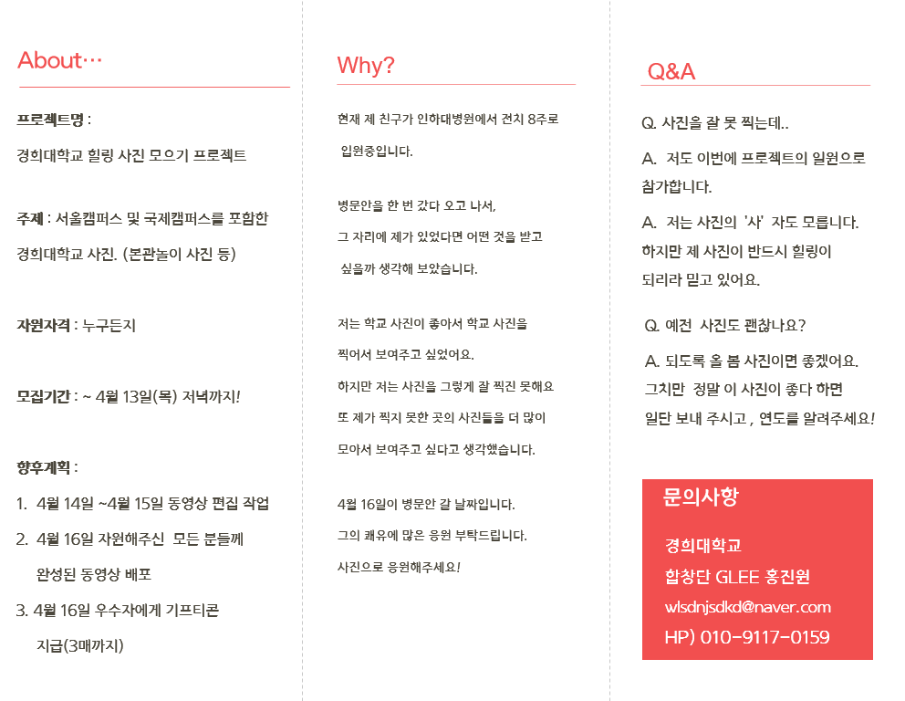
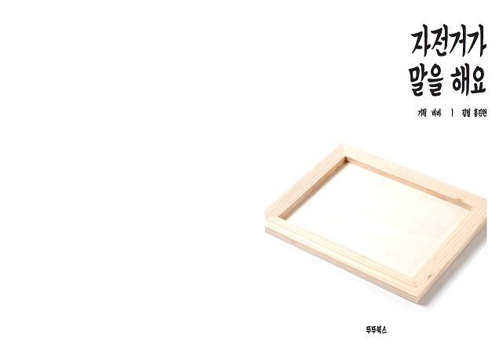
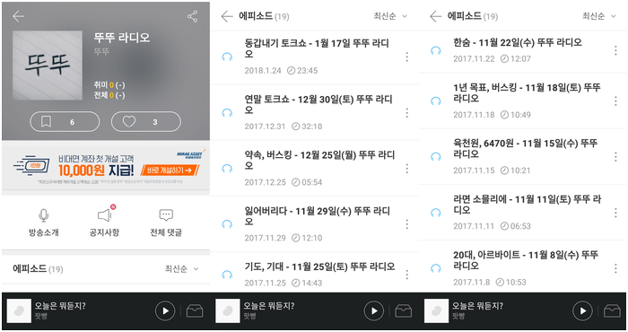
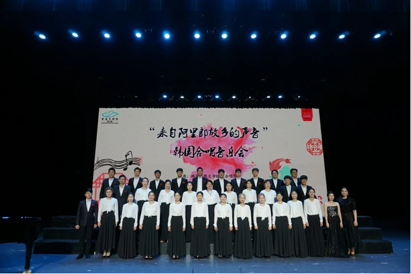

# Challenges

살면서 홍진원 군이 꾸민 일들은 여럿 있지만, 공통적으로 예술과 관련된 일이 많았습니다. 

예술이라는 단어를 보면 무엇이 떠오르십니까? 

음악? 미술? 

홍진원 군에게는 그림\(회화\), 글\(문예\), 소리\(노래/연극\), 영상, 게임 등이 떠올랐습니다. 전반적으로 기록 예술에 관심이 많았죠. 졸업 후 도전한 게임 제작을 제외하면, 홍진원 군은 대학 생활 동안 위에 열거한 예술을 전부 경험했습니다. 

이 페이지에서는 그가 경험한 예술들 중에서 기획을 맡았던 항목들을 위주로 소개하고 있습니다. 

## 1. 사진: 경희대학교 힐링 프로젝트\(2017. 4\)

그림이 서툴렀던 홍진원 군은 놀랍게도 사진 찍기에도 소질이 없었습니다. 하지만 경희대학교의 봄 풍경은 누구라도 품고 싶을 만큼 가치가 있었죠. 그러면 사진을 더 잘 찍는 사람한테 도움을 청하자! 

그가 혼자 힘으로 기획해 본 프로젝트는 이것이 처음이었습니다. 힐링 사진을 여러 사람들에게 모아, 우수상으로 아이스크림 쿠폰을 보내 주었죠. 참가한 모든 사람들에게는 직접 만든 영상을 선물했습니다.



## 2. 책: 자전거가 말을 해요\(2017. 9 ~ 12\)

3학년 2학기를 맞아 홍진원 군은 책 쓰기 교양 수업을 신청하고, 3개월 간 꾸준히 노력한 끝에 50p 가량의 작은 에세이를 출판했습니다. 자전거를 관찰자로 설정한 것이 이 책의 특징입니다. 자전거의 시점에서, 집필자 주위의 다양한 사람들의 삶을 담아내는데 성공하죠. 

그는 출판한 책 세 권을, 과제 제출용으로 하나. 대학 시절 은사\(선배\)에게 하나. 본인 소장용으로 하나 나누었습니다.

## 3. 라디오: 뚜뚜 라디오\(2017. 10 ~ 2018. 1\)

[링크](http://www.podbbang.com/ch/15151)

홍진원 군은 평소에 품고 있던 자신의 생각을 정리하고, 주변 사람들의 이야기를 담아내기 위해 라디오 팟캐스트를 기획했습니다. 19편의 에피소드가 있는데, 어떤 에피소드는 친구를 직접 초대하거나, 따로 인터뷰를 한 다음 녹여내기도 했죠. 

소중한 사람들에게 자신의 라디오를 선물하고, 그들로부터 힐링이 되었다는 말을 돌려받으며 홍진원 군은 본연의 목적을 달성했음을 확인했습니다.

## 4. 합창: 중국 합창 공연 기획단\(2018. 6 ~ 9\)

2016년 일본 합창 공연 기획에 참여했었던 홍진원 군은, 후배에게 초청받아 다시 한 번 공연 기획에 참여하게 되었습니다. 회계 감독 겸 예산안을 설정함으로써, 참가 단원의 참가비를 확정하고 그 안에서 모든 것을 해결하도록 도왔죠. 자신을 키운 합창단에 좋은 경험으로 보답한 것에 굉장한 뿌듯함을 느끼는 듯했습니다.

## 5. 영상: 졸업 기념 영상\(2018. 12\)



졸업을 앞둔 홍진원 군은, 그동안 모아 온 3000장의 사진과 본인의 영상 기술을 총동원해, 자신의 대학 시절을 하나의 영상으로 녹여내는 데 성공합니다. 그 즈음 홍진원 군은 자신이 앞으로도 계 무언가를 만드는 일에 전념할 것임을 운명처럼 받아들이게 되었습니다.

## 6. 게임: VR 게임 Crush&Rush\(2019. 10 ~ 11\)



연이은 취업 실패로 방황하던 중, [어떠한 계기](mytimes.md#2-now)로 VR/AR 콘텐츠 교육 과정에 뛰어든 홍진원 군. 3개월 간의 공부 끝에 자신만의 게임을 기획, 개발하는 데 성공합니다. 그동안 그가 해왔던 도전 중 가장 어려웠고, 가장 많은 시간을 들인 것이 게임 개발이었습니다. 그동안의 도전들이 없었다면 해낼 수 없었을 거라고 회상했죠. 

앞으로 계속될 홍진원 군의 활약을 기대해 봅니다.

[제작 후기](https://app.gitbook.com/@hongjinone/s/systemdesign/)

